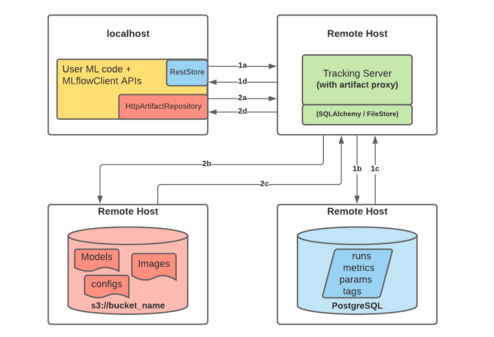
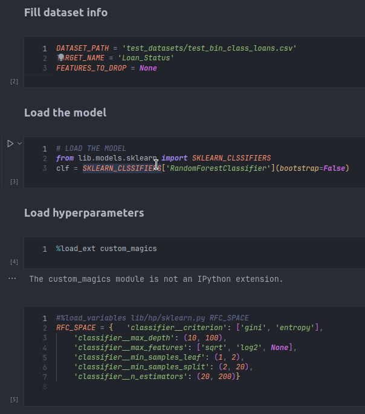
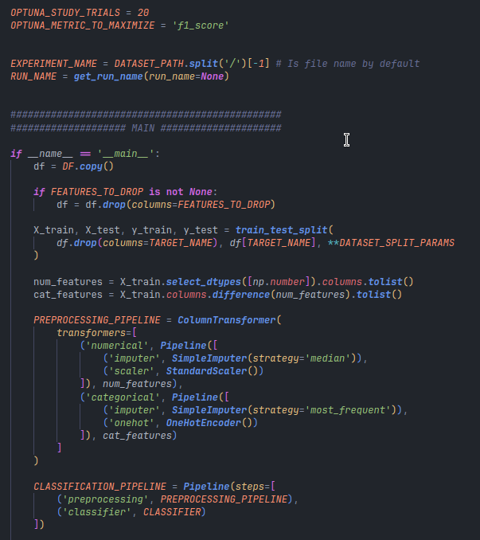
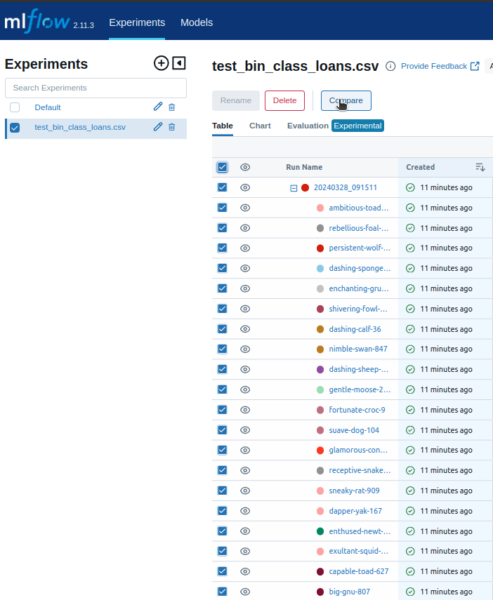
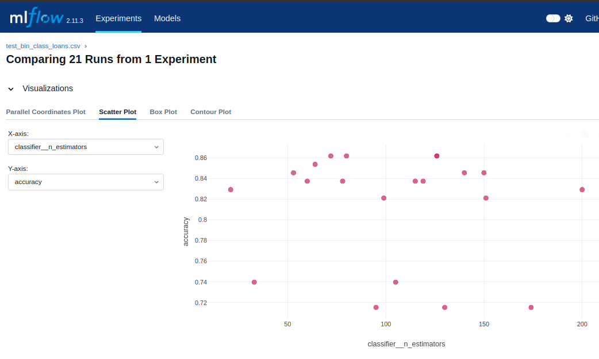
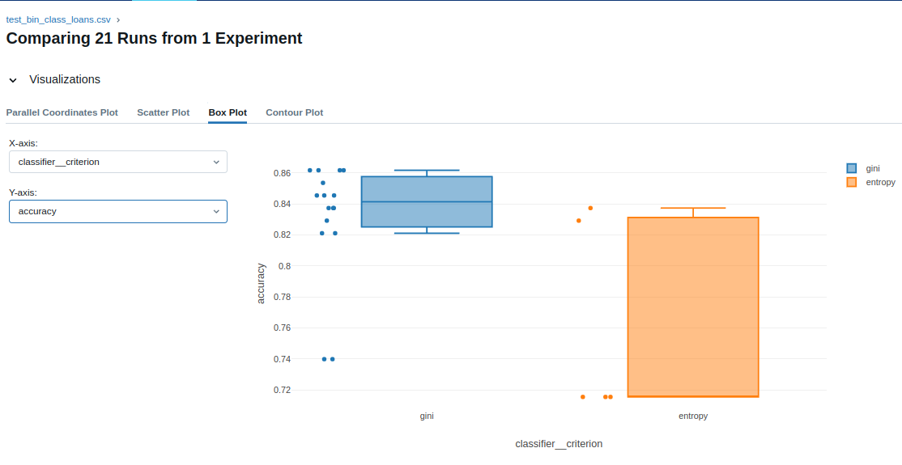
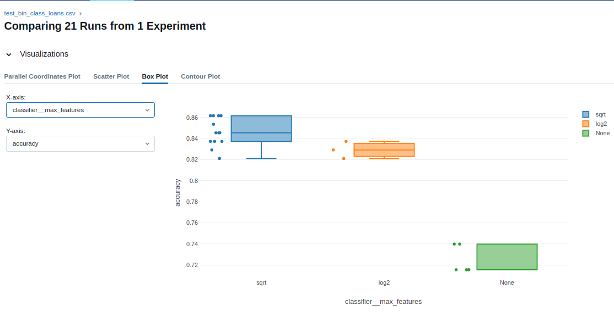

# MLflow Laboratory

*Quick hyperparameter tuning and training script generation*


---
## ***Work In Progress! See roadmap***

---

Welcome to the MLflow Laboratory, your one-stop solution for hyperparameter tuning, model experimentation, and MLflow experiment tracking. This project is designed to speed up and automate the process of machine learning model experimentation, leveraging the power of notebooks for open, easily modifiable code. Whether you're testing different models, exploring hyperparameter ranges, or tracking experiments with MLflow, this guide will help you get started and make the most of MLflow Laboratory.


## **Project Overview**

MLflow Laboratory aims to streamline the machine learning workflow by providing:

- A comprehensive bank of hyperparameters and their ranges or choices, which will be continuously updated.
- Generic machine learning training scripts that can be loaded into a Jupyter notebook or executed from the terminal.
- Integration with MLflow for experiment tracking, making it easier to log parameters, metrics, and artifacts.

The project's structure encourages open code practices, allowing for easy rewriting and modification of code parts that don't fit a particular situation, unlike packaged code.


## **Getting Started**

### **Prerequisites**

Before you begin, ensure you have the following installed:

- Linux based OS
- Docker / Docker-Compose
- Makefile
- Python (with `numpy`, `pandas`, `mlflow`, `optuna`, `scikit-learn`)
- MinIO (local or remote setup for artifact storage)  

Docker is used to containerize the mlflow server only, you're free to run experiments on whatever fits your needs: a python virtual environment, another docker container...  

This project uses mlflow's remote server structure:  [remote-server](https://mlflow.org/docs/latest/tracking/tutorials/remote-server.html)


The artifact store is a MinIO container, which behaves like a local s3 bucket and can be easily ported to an AWS s3 bucket. 


### **Installation**

Clone the repository to your local machine:
```bash
git clone https://github.com/MatthieuLeNozach/mlflow_laboratory
```
**Navigate into the `project directory`**  

### **Setup**

To get the whole MLflow service up and running, use the Makefile commands:

```bash
# Load environment variables and start services with Docker Compose:
make up

# To stop and remove containers, networks, and the default network bridge:
make down

```

### **Connecting to MLflow UI**

After running `make up`, the MLflow tracking server will be accessible. You can connect to the MLflow UI by navigating to `http://localhost:5000` in your web browser. Here, you can view and compare experiments, runs, parameters, and metrics.


## **Experimentation Workflow**


### **Run experiments in Notebooks**
**Navigate into `/notebooks`**  

duplicate and open `/notebooks/template.ipynb`  

Here is the pre-loaded code:  


#### **a. Choose a model**  

- Scikit-learn models are available with one single import at `project_root/lib/models/sklearn.py`  
- XGBoost: # TODO


```py
# Import a model with:
from lib.models.sklearn import RandomForestClassifier
rfc = RandomForestClassifier()

##############################################

# Or import all classes in a dict at once with:
from lib.models.sklearn import SKLEARN_CLASSIFIERS
# ... and instantiate them with:
rfc = SKLEARN_CLASSIFIERS['RandomForestClassisier'](bootstrap=True)
svc = SKLEARN_CLASSIFIERS['SVC']()
...
```
#### **b. Select hyperparameters**
Automatic hyperparameter tuning is performed with Optuna library,
More information is available at [https://optuna.readthedocs.io/](https://optuna.readthedocs.io/en/stable/tutorial/index.html).  

The growing bank of hyperparameters is available under `project_root/lib/hp/...`. For example:


```py
# Hyperparameters for RandomForestClassifier
RFC_SPACE = {
    'classifier__n_estimators': (20, 200),
    'classifier__max_depth': (10, 100),
    'classifier__min_samples_split': (2, 20),
    'classifier__min_samples_leaf': (1, 2),
    'classifier__max_features': ['sqrt', 'log2', None],
    'classifier__criterion': ['gini', 'entropy'],
}
```
Hyperparameter naming convention is `XXXC_SPACE` (ex `KNNC_SPACE`) for classification, / `XXXR_SPACE` (ex `RFR_SPACE`) for regression.  

Load hyperparameters:  

```bash
# Enable custom magics
%load_ext custom_magics
# load a set of hyperparameters
%load_variables ../lib/hp/sklearn.py RFC_SPACE
```
#### **a. Retrieve scripts**

The growing bank of hyperparameters is available under `project_root/scripts/...`. 
Paste and execute one of these commands into a code cell to retrieve a mlflow script:

**Classification**  
- Binary: `%load ../scripts/binary_classification.py`
- Multiclass: #TODO

**Regression**  
- #TODO


### **Run experiments in the terminal**

**Navigate into the `/scripts`**  

- Choose and duplicate a script
- Add hyperparameters from `/lib/hp`
- Modify these fields:
>```py
>
> DATASET_PATH = DATASET_PATH # PLACEHOLDER, fill only when used as executable script
> DF = pd.read_csv(DATASET_PATH)
>
>TARGET_NAME = TARGET_NAME # Another PLACEHOLDER...
>FEATURES_TO_DROP = FEATURES_TO_DROP # PLACEHOLDER
>
>DATASET_SPLIT_PARAMS = {'test_size': 0.2, 'stratify': DF[TARGET_NAME], 'random_state': 42} # or stratify=None
>
>CLASSIFIER = clf # PLACEHOLDER
>SPACE = RFC_SPACE # PLACEHOLDER
>SAVE_MODEL = False
>
>OPTUNA_STUDY_TRIALS = 20
>OPTUNA_METRIC_TO_MAXIMIZE = 'f1_score'  
>
>
>EXPERIMENT_NAME = DATASET_PATH.split('/')[-1] # Experiment name is file name by default
>RUN_NAME = get_run_name(run_name=None) # Run name is date+time by default
>```
- Modify the pipeline if needed 


## **Test Run**




#### **MLflow UI**







