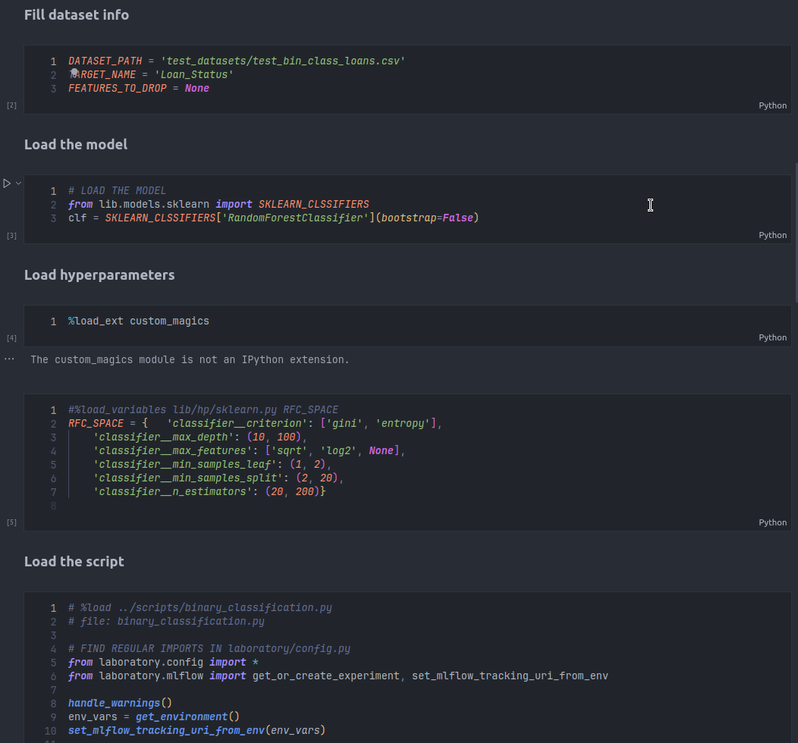

# mlflow_laboratory
Quick hyperparameter tuning and training script generation
## **Work In Progress**


## **Installation**
 -**# TODO**

```bash
git clone https://github.com/MatthieuLeNozach/mlflow_laboratory
```
**Requirements**:
- Linux based OS
- Docker / Docker-Compose
- Make
- python:
  - numpy
  - pandas
  - mlflow
  - optuna
  - scikit-learn
- Minio (local or remote)
  
The chain of events is hidden under a Makefile abstraction:
```bash
# Load env variables and docker-compose up:
make up

# docker-compose down and purge env variables:
make down
```


## **Notebooks**
duplicate and open `/notebooks/template.ipynb`


#### **a. Choose a model**
All scikit-learn models are available with one single import at `project_root/lib/models/sklearn.py`
```py
# Import a model with:
from lib.models.sklearn import RandomForestClassifier
rfc = RandomForestClassifier()*
# Or import all classes in a dict at once with:
from lib.models.sklearn import SKLEARN_CLASSIFIERS
# ... and instantiate them with:
rfc = SKLEARN_CLASSIFIERS['RandomForestClassisier'](bootstrap=True)
svc = SKLEARN_CLASSIFIERS['SVC']()
```
#### **b. Select hyperparameters**
Automatic hyperparameter tuning is performed with Optuna library,
More information is available at [https://optuna.readthedocs.io/](https://optuna.readthedocs.io/en/stable/tutorial/index.html).  

**WIP** An hyperparameter bank is being built, see at `project_root/lib/hp/...`
The goal is to store their name, a range if they are numerical or a list of choices.  
Here's an example:
```py
# Hyperparameters for RandomForestClassifier
RFC_SPACE = {
    'classifier__n_estimators': (20, 200),
    'classifier__max_depth': (10, 100),
    'classifier__min_samples_split': (2, 20),
    'classifier__min_samples_leaf': (1, 2),
    'classifier__max_features': ['sqrt', 'log2', None],
    'classifier__criterion': ['gini', 'entropy'],
}
```
Hyperparameter naming convention is `XXXC_SPACE` (ex `KNNC_SPACE`) for classification, / XXXR_SPACE (ex `RFR_SPACE`) for regression.  

 Load hyperparameters:
```bash
# Enable custom magics
%load_ext custom_magics
# load a set of hyperparameters
%load_variables ../lib/hp/sklearn.py RFC_SPACE
```
#### **a. Retrieve scripts**

Paste and execute one of these commands into a code cell to retrieve a mlflow script:

**Classification**  
- Binary: `%load ../scripts/binary_classification.py`

**Regression**  
- #TODO

